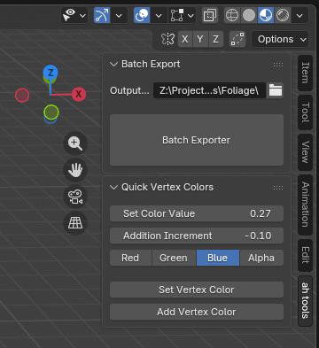
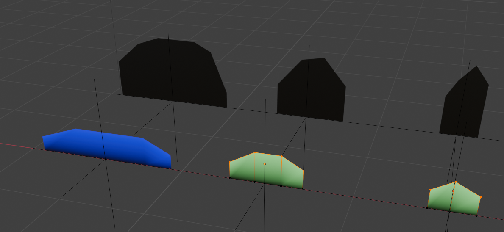
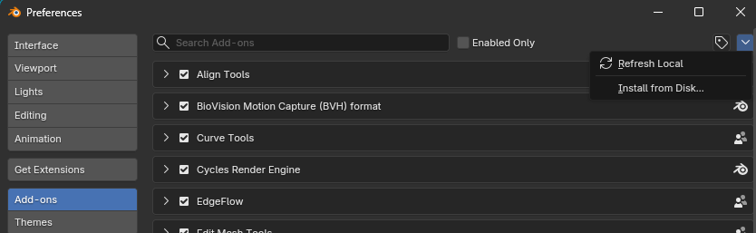

# Blender Utility Scripts
Miscellaneous utility scripts for Blender to ease my switch over from Maya

Menu panel location for all tools with a menu

## ah_batch_exporter

Exports selected objects as separate fbx files. Parent the exportable model to an empty, and name the empty as the desired filename. The script moves the selected root objects to scene origin and exports them to the selected directory.

The tool can be found on the right side of the viewport next to the gizmo and item properties (click on the tiny arrow for the toolbar to come out)

## ah_set_vertex_colors

Modify vertex colors for the selected vertices by color channel.

-	**Set Color Value** (0..1): Sets the color to this value when pressing the _Set Vertex Color_ button
-	**Addition Increment** (-1..1): Adjusts the color by this value when pressing the _Add Vertex Color_ button. Negative values subtract
-	**Red | Green | Blue | Alpha**: The color channels affected by the tool. Multiple can be selected by shift+clicking
-	**Set Vertex Color**: Sets/overwrites the color to the value specified above
-	**Add Vertex Color**: Adjusts the color relative to the current color

## ah_change_grid_subdivs

No menu, only hotkeys
This script changes the grid size with a hotkey, either doubling or halving the line spacing. 
By default the hotkeys are:
| Hotkey | Function |
| --- | --- |
| shift + NUM+ |  Increase Grid Size (Double spacing)|
| shift + NUM- |  Decrease Grid Size (Halve spacing)|
| shift + NUM0 |  Reset Grid Size |

## ah_change_snap_mode

No menu, only hotkeys
Adds the option to assign hotkeys to scroll through snapping modes, or to directly jump to a specific snapping mode. Out of the box pressing control while transforming objects lets you turn on snapping, but to select the mode (e.g. vertex, grid, etc.) you need to click through a dropdown. By default none of the hotkeys are set to not overwrite any default blender behavior, so you need to assign them yourself.

## Install

1. Download any of the scripts from here and save them wherever
2. In Blender, open preferences -> add-ons and select 'Install from disk'
3. Navigate to the script you downloaded and select it
4. The addon is now installed. You can find the key binding by searching 'ah' in the blender keymap

